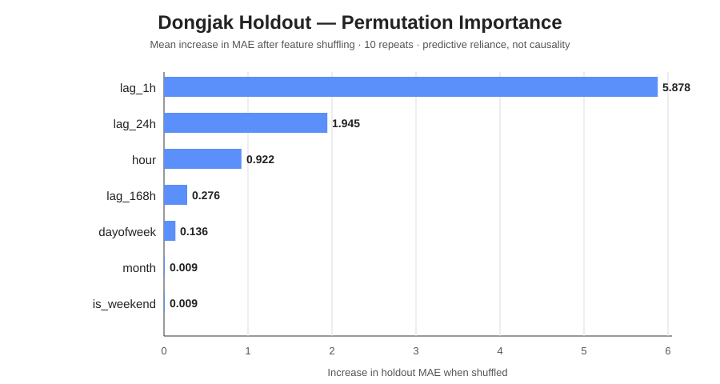
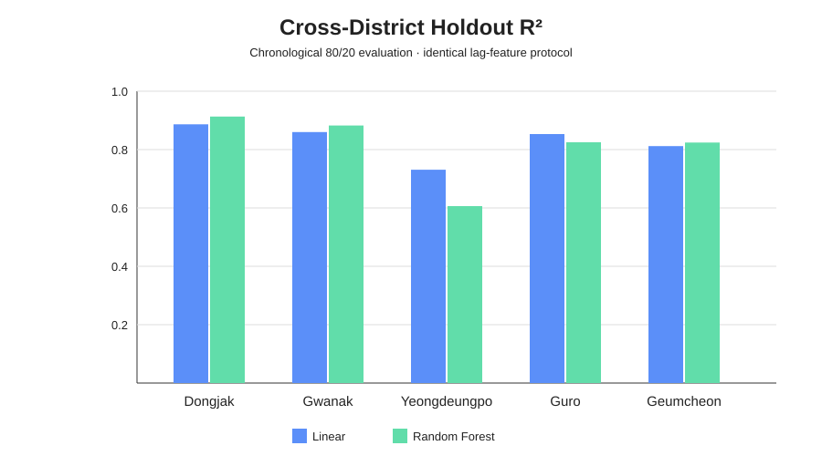

# Delivery Demand Forecasting

**Machine Learning-Based Delivery Demand Forecasting — Revisiting and Extending a 2022 Undergraduate Capstone Project**

## Overview
This project revisits an undergraduate capstone originally conducted in 2022 and rebuilds the analysis from the legacy raw data. The 2026 revision focuses on reproducible preprocessing, time-aware validation, leakage prevention, controlled feature experiments, and explicit limitations.

The goal is not to claim an operational delivery-pricing system. The current research question is narrower:

> **How well can hourly delivery demand be forecast from calendar information and historical demand patterns, and do additional variables provide measurable out-of-sample value?**

## Pilot scope
The first frozen pilot uses **Dongjak-gu, Seoul** because it had the highest hourly observation coverage among the 25 districts in the supplied order dataset.

- Raw observation span: 2019-07-17 10:00 → 2021-07-31 23:00
- Hourly coverage: ~84.31%
- Total observed orders: 259,203
- Modeling rows after exact 1h/24h/168h lag alignment: 12,486
- Validation: chronological 80/20 holdout
- Metrics: MAE, RMSE, R²

Missing timestamps are **not automatically interpreted as zero demand**.

## Main pilot result

| Model | MAE ↓ | RMSE ↓ | R² ↑ |
|---|---:|---:|---:|
| Naive 24h | 5.1133 | 9.3772 | 0.8093 |
| Linear Regression | 4.4351 | 7.2347 | 0.8865 |
| **Random Forest** | **4.0676** | **6.3335** | **0.9130** |

On the frozen Dongjak-gu holdout, Random Forest performed best among the three tested approaches. This is a **pilot result on incomplete legacy observations**, not a claim of Seoul-wide generalization or “91.3% accuracy.”

## Controlled feature experiments

### Weather
Weather was evaluated only on timestamps shared by the demand and weather datasets.

| Model | MAE ↓ | RMSE ↓ | R² ↑ |
|---|---:|---:|---:|
| Base Linear | 4.2399 | 5.7297 | 0.7366 |
| Linear + Weather | 4.2403 | 5.7166 | 0.7378 |
| **Base Random Forest** | **3.6439** | **5.0058** | **0.7990** |
| RF + Weather | 3.7288 | 5.1330 | 0.7886 |

The available weather fields did **not** improve Random Forest holdout performance. The result is reported as-is rather than selecting only successful feature additions.

### Lagged average order value
Same-hour realized average order value was excluded because it would risk target-time information leakage. Only historical 24h/168h values were tested.

| Model | MAE ↓ | RMSE ↓ | R² ↑ |
|---|---:|---:|---:|
| Base Linear | 9.0435 | 14.1149 | 0.8769 |
| Linear + lagged AOV | **9.0402** | **14.1083** | **0.8770** |
| Base Random Forest | 11.4681 | 18.5825 | 0.7867 |
| RF + lagged AOV | **11.0612** | **17.9146** | **0.8017** |

Lagged AOV added some signal to Random Forest on this restricted sample, but Linear Regression still performed better over the same evaluation period. These scores are not directly comparable with the full-period pilot because the available date range differs.

## What drives the Dongjak pilot?



Holdout permutation importance shows that the Random Forest relies most strongly on **one-hour lagged demand**, followed by **previous-day same-hour demand**. Calendar variables contribute less on this test period. These values describe predictive reliance only and should not be interpreted causally.

## Cross-district robustness



The same time-aware pipeline was evaluated in the five highest-coverage districts selected before model-score comparison. Random Forest was strongest in Dongjak-gu, Gwanak-gu, and Geumcheon-gu, while Linear Regression performed better in Yeongdeungpo-gu and Guro-gu. This argues for retaining both models rather than claiming one universally superior algorithm.

## Methodology
- Aggregate to district × timestamp before modeling.
- Measure observation coverage before selecting a pilot area.
- Never assume an absent timestamp means zero demand without evidence.
- Create lag features by **exact timestamp alignment**, not row position.
- Split train/test chronologically.
- Compare feature sets on identical observations.
- Exclude variables unavailable at forecast time.
- Keep negative or neutral experiments rather than reporting only improvements.
- Treat feature importance as predictive reliance, not causal evidence.

## Project history
### Original Capstone — 2022
The undergraduate project explored machine-learning-based delivery-demand analysis and possible connections to rider supply and delivery-fee decisions.

### Revisited & Extended Analysis — 2026
The project rebuilds the analysis from the original files, tightens the forecasting question, audits data coverage, prevents leakage, and evaluates models on future observations.

## Repository structure
```text
.
├── README.md
├── data/
│   └── README.md
├── docs/
│   ├── missing_time_protocol.md
│   └── model_diagnostics.md
├── notebooks/
│   ├── 01_data_preprocessing.md
│   ├── 02_eda.md
│   ├── 03_baseline_model.md
│   └── 04_weather_experiment.md
├── results/
│   ├── pilot_baseline_results.md
│   ├── weather_experiment_results.md
│   ├── lagged_aov_experiment.md
│   └── top5_coverage_summary.csv
├── src/
│   ├── coverage_audit.py
│   ├── build_model_table.py
│   ├── baseline_model.py
│   ├── lagged_aov_experiment.py
│   └── model_diagnostics.py
├── figures/
├── requirements.txt
└── .gitignore
```

## Data and reproducibility
Large raw datasets are not committed. Redistribution rights for legacy source files must be checked before publication. The repository documents data structure and processing rules so the analysis can be reconstructed from legitimately obtained source data.

## Limitations
1. Observation coverage is incomplete and varies substantially by district.
2. The pilot is currently restricted to one district and historical data.
3. Weather metadata still require final source-field verification before semantic interpretation of every legacy field.
4. AOV is derived from category-level averages rather than transaction-level weighted values.
5. Forecasting performance does not establish causal relationships.
6. The project does not currently support a defensible claim of an “optimal delivery fee.”

## Next steps
- Generate holdout actual-vs-predicted and error diagnostics.
- Calculate permutation importance on the frozen test period.
- Inspect large-error timestamps without deleting difficult observations.
- Test generalization across additional high-coverage districts.
- Evaluate additional tree-based models only if they add methodological value.

## Status
**Active 2026 rebuild.** The baseline pipeline and two controlled feature experiments are documented; model diagnostics and broader validation are in progress.
